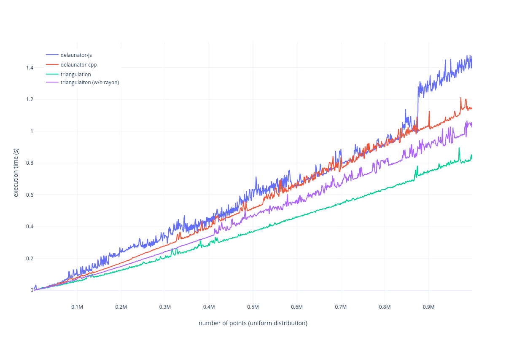

Rust port of [delaunator](https://github.com/mapbox/delaunator).

## [Demo](https://leshainc.gitlab.io/triangulation/)

WASM based browser demo. See `wasm-demo/` folder.

## Documentation

 - [master branch](https://leshainc.gitlab.io/triangulation/doc)
 - [release](https://docs.rs/triangulation)

## Example

```rust
use triangulation::{Delaunay, Point};

let points = vec![
    Point::new(10.0, 10.0),
    Point::new(100.0, 20.0),
    Point::new(60.0, 120.0),
    Point::new(80.0, 100.0)
];

let triangulation = Delaunay::new(&points).unwrap();
assert_eq!(&triangulation.triangles, &[3, 0, 2, 3, 1, 0]);
```

## Performance



Tests performed on Intel Core i5-2500 CPU @ 3.30GHz x 4

## License

This project is licensed like the Rust language itself under either of

 - Apache License, Version 2.0 (see the `LICENSE-APACHE` file
   or http://www.apache.org/licenses/LICENSE-2.0)
 - MIT license (see the `LICENSE-MIT` file
   or https://opensource.org/licenses/MIT)

at your option.
